# Veille Emploi — pipeline d'automatisation de recherche d'emploi

> Deux workflows **n8n** qui, chaque jour, **collectent → normalisent → dédoublonnent (RAG) → matchent à mon CV → scorent par IA → résument** les offres d'emploi pertinentes dans un digest email. Auto-hébergé (n8n + Postgres + Qdrant + embeddings Ollama), inférence LLM sur API gratuite (Groq).

Cas d'usage réel : automatiser une veille ciblée (profil **Sales / RevOps**, remote, France / EMEA) à partir de deux canaux complémentaires — des **feeds d'offres** (API/RSS de job boards) et les **alertes email** de plateformes (LinkedIn, Welcome to the Jungle…). Le tout tourne sur un Mac M1 8 Go, sans API payante.

---

## Ce que ça fait

- **Agrège** les offres de 7 job boards (API + RSS) **et** les alertes email de plateformes.
- **Normalise** 7 formats d'API hétérogènes vers un schéma unique.
- **Filtre** par rôle (sur le titre **et** la description) et par localisation.
- **Dédoublonne sémantiquement** via un vector store — y compris les mêmes offres postées sur plusieurs sources.
- **Matche** chaque offre à mon CV par similarité cosinus (RAG).
- **Score** chaque offre 0-10 avec un LLM, avec une **raison spécifique** par offre.
- **Livre** un digest quotidien (Markdown archivé + email HTML), sections *Top* / *À suivre*.

---

## Architecture

```mermaid
flowchart TB
    subgraph INFRA["🖥️ Infra locale — Docker (Mac M1 8 Go)"]
        N8N["n8n · orchestrateur"]
        PG[("PostgreSQL<br/>backend n8n")]
        QD[("Qdrant<br/>vector store")]
        OL["Ollama · bge-m3<br/>embeddings (local)"]
    end
    GROQ["☁️ Groq API<br/>LLM · free tier"]

    subgraph W1["W1 — Feeds (API / RSS)"]
        direction TB
        A1["⏰ Schedule"] --> A2["7 sources + recherche ciblée par rôle"]
        A2 --> A3["Normalize & Filter"]
        A3 --> A4["Dedup + Embed"]
        A4 --> A5["Match CV (cosinus)"]
        A5 --> A6["Score LLM"]
        A6 --> A7["Digest + Email"]
        A7 --> A8["Index Qdrant<br/>(après envoi)"]
    end

    subgraph W2["W2 — Alertes email"]
        direction TB
        B1["⏰ Schedule"] --> B2["Gmail · label job-alerts"]
        B2 --> B3["Filter Seen<br/>(idempotence)"]
        B3 --> B4["Extract LLM<br/>(1 appel / email)"]
        B4 --> B5["Filter rôles"]
        B5 --> B6["Score LLM"]
        B6 --> B7["Digest + Email"]
        B7 --> B8["Mark Seen<br/>(après envoi)"]
    end

    A4 <-->|"embed + dédup"| OL
    A4 <--> QD
    A5 <--> QD
    A6 --> GROQ
    B4 --> GROQ
    B6 --> GROQ
    W1 -.-> N8N
    W2 -.-> N8N
    N8N --- PG
```

Deux pipelines indépendants (isolation debug + activation séparée) qui partagent la même infra. La logique vit dans **PostgreSQL** (base n8n) ; le repo porte des **snapshots JSON** versionnés + les conventions.

---

## Pipeline W1 — Feeds (API / RSS)

| Étape | Node(s) | Rôle |
|---|---|---|
| **Déclenchement** | Schedule Trigger | Quotidien (jours ouvrés) |
| **Ingestion** | 7 fetch en parallèle : Remotive, Jobicy, WeWorkRemotely (RSS), France Travail (OAuth2, 3 mots-clés), Himalayas, The Muse (paginé), RemoteOK · + un node Code de **recherche ciblée** (Account Executive / Account Manager / Business Development) | Maximiser le rappel sur le profil |
| **Normalisation** | `Normalize & Filter` (Code) | **Détection de shape** des 7 formats → schéma unique ; filtre rôle (titre + desc), filtre localisation, dédup titre+entreprise |
| **Dédup sémantique** | `Dedup + Embed` (Code) | Skip si l'URL est déjà dans Qdrant `job_listings` ; sinon embed via **bge-m3** (1024-dim) |
| **Matching CV** | `Match CV` (Code) | Similarité cosinus de l'offre vs Qdrant `cv_profile` (CV découpé en sections) |
| **Scoring IA** | `Score LLM` (Groq `llama-3.3-70b`) | Score 0-10 + classe (top/watch/skip) + raison spécifique, en JSON |
| **Livraison** | `Format Digest` → `Save` → `Send Email` (Gmail) | Digest Markdown + email HTML (badges score & CV) |
| **Indexation** | `Index New Jobs` (Code) | Upsert Qdrant **après l'envoi** (idempotence) |

## Pipeline W2 — Alertes email

| Étape | Node(s) | Rôle |
|---|---|---|
| **Déclenchement** | Schedule Trigger | Quotidien |
| **Lecture** | `Fetch Email IDs` (Gmail, label `job-alerts`, *returnAll*) | Récupère toutes les alertes de la fenêtre |
| **Idempotence** | `Filter Seen` (Code, `staticData`) | Ne garde que les emails jamais traités (lecture seule) |
| **Extraction IA** | `Fetch Email Full` → `Extract LLM` (Groq `llama-4-scout`, ctx 131K) | Extrait toutes les offres d'un email HTML (LinkedIn & co.) en JSON |
| **Filtrage** | `Parse & Normalize` → `Filter by Keywords` | Schéma unique + filtre rôle/localisation |
| **Scoring & livraison** | `Score LLM` (Groq) → `Format Digest` → `Send Email` | Idem W1 |
| **Idempotence** | `Mark Seen` (Code, `staticData`) | Marque les emails traités **après l'envoi** |

---

## Choix d'ingénierie notables

- **Ingestion multi-API tolérante aux pannes** — 7 formats JSON/RSS différents unifiés par détection de shape ; chaque source en `continueErrorOutput` → une source morte est *loggée*, pas fatale.
- **RAG local pour les données perso** — dédup sémantique + matching CV via embeddings **bge-m3** + Qdrant : le CV et les offres ne quittent jamais la machine.
- **Routage LLM adaptatif, par tâche** — embeddings en **local** (confidentialité, coût nul), scoring + extraction sur **Groq** (qualité, free tier). Le choix est fixé par étape via variables d'env — *pas* de node Switch.
- **Idempotence « mark-after-action »** — une offre / un email n'est marqué « vu » qu'**après** l'envoi réussi du digest. Un run qui plante en cours de route ne perd aucune offre et n'envoie pas de doublon.
- **Robustesse** — retries + timeouts par node, `executionTimeout` par workflow, **error workflow global**, et **modes dégradés** (le digest part même si le scoring LLM échoue, avec les offres brutes).
- **Configuration externalisée** — paths, URLs, modèles, seuils, destinataire : tout en variables d'environnement (`VEILLE_*`, `GROQ_*`). Aucun *magic string* dans les workflows → portables et diffables.

---

## Stack technique

| Composant | Rôle |
|---|---|
| **n8n** | Orchestration des workflows (self-hosted) |
| **PostgreSQL** | Backend n8n (workflows, exécutions, état) |
| **Qdrant** | Vector store (dédup `job_listings`, CV `cv_profile`) |
| **Ollama** (`bge-m3`) | Embeddings locaux (RAG) |
| **Groq API** (`llama-3.3-70b`, `llama-4-scout`) | Inférence LLM (scoring, extraction) — free tier, OpenAI-compatible |
| **Gmail API / France Travail API** | Sources de données (OAuth2) |
| **Docker Compose** | Packaging de la stack sur Mac M1 8 Go |

---

## Résultats (mesurés)

Sur une exécution réelle après refonte :

| Métrique | Valeur |
|---|---|
| W1 — offres brutes → retenues après filtre | ~500 → **64** |
| W1 — digest | **9 top + 18 à suivre** |
| W2 — digest | **19 top + 12 à suivre** |
| Qualité du scoring | raisons **spécifiques** par offre (ex. *« Revenue Operations Bordeaux »*, *« Fivetran EMEA »*) |
| Coût d'inférence LLM | **0 €** (Groq free tier) |

---

## Configuration & sécurité

- **Aucun secret dans le repo.** Les clés API et tokens OAuth vivent (a) chiffrés dans le *credential store* de n8n, (b) en variables d'environnement hors dépôt (`~/.zsh_secrets`), référencés dans les workflows par `$env.*` ou par ID de credential.
- Les **snapshots de workflow** versionnés (`workflows/*.json`) ne contiennent que des **références** de credentials (id + nom) — jamais les valeurs (comportement standard des exports n8n).
- La **config non-sensible** (URLs, modèles, chemins, `VEILLE_*` / `GROQ_*`) est dans `docker-compose.yml`, versionnée.
- Le bind-mount `shared/` (CV, digests, backups) est **gitignoré**.

---

## Repo & runtime

| Élément | Emplacement |
|---|---|
| Snapshots workflows | [`workflows/`](workflows/) (`q2crCIIaJhSsXfRx` = W1, `b8erSgFcfJ32W7vx` = W2, `y3fd7SBf6dhU261q` = error handler) |
| Conventions d'ingénierie | [`../../n8n/conventions.md`](../../n8n/conventions.md) — robustesse, observabilité, idempotence, exportabilité |
| Runtime (source de vérité) | PostgreSQL (base n8n) — les snapshots du repo en sont une copie versionnée |
| Données (gitignorées) | `shared/veille-emploi/{cv,jobs,emails,backups}` |
